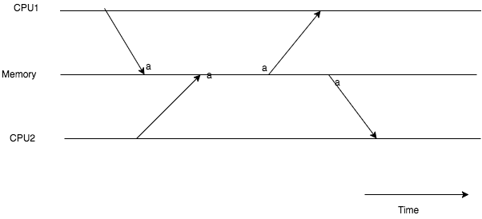

# Chapter 4

## 前提

xv6 是運行在多個 processors 的 OS，也就是運行在多個獨立的 CPUs 的 OS。這些 CPUs 會共享實體的 RAM，這些 CPUs 會對共享的 RAM 做 `讀取` 及 `寫入` 的動作。由於同一時間有可能有多個 CPU 同時對 Memory 中相同的資料做 `讀` `寫`，導致資料問題。

因此有了 `Lock` 的解決方式。這一解決方式就是使得某一時間只能有一個 CPU 對某個在 Memory 中的某個資料做 `讀` `寫` 的動作。

## Race Conditions:

以上說明了為何需要 `Locks`。接下來說明何謂 `Race Condition`:

簡單的說，假設有 CPU1 及 CPU2。這兩個 CPU 都會先寫入資料到 a，接著再讀取 a 的資料。這時如果 CPU1 寫入資料到 a 後尚未讀取 a 資料前 CPU2 寫入資料到 a。接著 CPU1 讀取 a 的資料，就會讀取到 CPU2 寫入的資料。這個情況我們就稱作 `Race Condition`。

